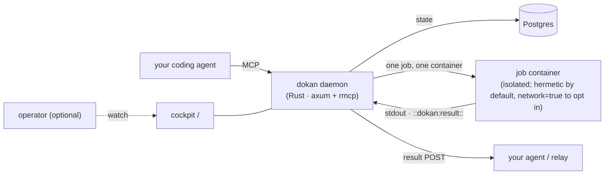
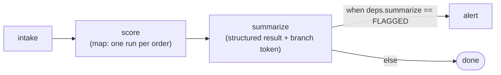

<p align="center"></p>

# dokan (導管)

<p align="center"><b>Your AI coding agent builds and runs the workflow. You don't click.</b></p>

<p align="center">Agent-operated automation runtime · deterministic scripts in Docker · <b>zero LLM inside</b> · Apache-2.0</p>

---

**dokan** is an automation runtime built for the agent era. Instead of a human clicking through a UI, your coding agent stands up, runs, and schedules workflows itself by talking to dokan over MCP. The platform runs deterministic code in clean containers and **burns zero tokens**: the expensive intelligence stays in your agent, outside the runtime.

Think *Sidekiq/cron for AI agents*: the agent scripts the mechanical 80%, dokan executes it cheaply and reliably, you don't touch a dashboard.

## Why dokan
- **Agent-operated.** your agent uploads, wires, triggers, reads logs over MCP. No UI.
- **Zero LLM inside = zero token burn.** deterministic code, not LLM-in-the-loop. The platform never spends tokens to run your workflows.
- **Hermetic by default.** one job = one clean container, per-job CPU/mem caps, timeouts, retries. Jobs run with **network disabled by default** (v0.4.0) — output is a pure function of its inputs, so identical inputs hit a content-addressed cache instead of recomputing, and the run is provable by re-execution. Set `network=true` for a job that must reach an API (most monitors do). Every run carries a tamper-evident receipt (advisory for networked runs, since their output can depend on the outside world).
- **Real triggers.** cron + inbound webhooks (POST /hook/<token>, Stripe/Calendly/GitHub-ready).
- **Token-frugal.** every MCP response is shaped for an agent's context budget — IDs over payloads, paginated logs, counts over dumps.

## How it works



A single Rust daemon (axum + an rmcp MCP server, stdio or Streamable HTTP). State lives in Postgres. Execution is one job → one fresh container (`python:3.12-slim` / `node:22-slim` / `alpine`), discarded after the run, with per-job caps and a hard timeout. Logs stream into Postgres, served cursor-paginated. A thin operator cockpit runs at `/`, Prometheus at `/metrics`. **No LLM runs inside dokan** — the agent is the only place tokens are spent.

## Quickstart
**Prereq:** Docker running (Docker Desktop, or colima / podman). The daemon talks to the default Docker socket — set `DOCKER_HOST` for colima/podman. No Rust toolchain needed.

One command stands up the runtime and installs the Claude Code operator skill:
```sh
curl -fsSL https://raw.githubusercontent.com/TsukumoHQ/dokan/main/install.sh | sh
```
It downloads and SHA-256-verifies the binary into `~/.local/bin`, lands the operator skill in `~/.claude/skills/dokan/` (where Claude Code loads it), generates per-install crypto keys (secure-by-default — secrets sealed at rest, receipts signed; saved `0600` in `~/.dokan/dokan.env`), starts Postgres on `:5499`, and brings up the daemon on `127.0.0.1:8088`. **Re-running is safe** (idempotent). Then wire your agent:
```sh
claude mcp add --transport http dokan http://127.0.0.1:8088/mcp
```
Verify it's up: open <http://127.0.0.1:8088/> (the operator cockpit) — once it loads, an agent can wire MCP and run scripts. Schema migrations apply automatically on boot.

<details><summary><b>Build from source instead</b> (contributors / unsupported platforms)</summary>

Needs a Rust toolchain. The default `DATABASE_URL` already points at the compose database, so there's nothing to configure.
```sh
docker compose up -d            # Postgres state store (pgvector) on :5499
cargo build --release
./target/release/dokan          # HTTP daemon on 127.0.0.1:8088 — UI at /, MCP at /mcp
```
You'll need crypto keys set (`DOKAN_SECRET_KEY`, `DOKAN_RECEIPT_KEY`, `DOKAN_RECEIPT_ED25519_SECRET`) or `DOKAN_DEV_INSECURE=1` for local dev — the daemon fails closed otherwise.
</details>

## Run your first job
With the daemon up, run the flagship demo — it drives a real DAG over MCP exactly the way an agent does (uploads 4 deterministic steps, wires a flow with `map` fan-out + a `when` branch, runs it, prints the result). No secrets, no job network, fully reproducible. Needs `curl` + `jq`:
```sh
./examples/flagship/run.sh        # override the daemon with DOKAN_ADDR=host:port
```
That's the whole loop — upload → compose → run → read — in one command. See [`examples/flagship/`](examples/flagship/) for the steps and the expected output.

## Wire into your agent (MCP)
Point your agent's MCP config at the daemon:
```jsonc
"dokan": { "type": "http", "url": "http://127.0.0.1:8088/mcp" }
```
Your agent now has the full dokan toolset over MCP.

## Core concepts

### Scripts
A script is code in `python` | `node` | `bash`. It reads its input from the **`DOKAN_INPUT`** env var (a JSON string — not stdin, not argv). Secrets arrive as their own env vars. `upload_script(..., upsert=true)` re-provisions by name idempotently, so a respawning agent never leaves orphan duplicates. A script's nonzero exit is treated as the script's **own deterministic verdict** (e.g. a monitor finding) and is *not* retried — only a genuine infra failure (container vanished / timeout) retries.

### Flows (DAG)
`compose_flow` wires scripts into a validated, acyclic graph; `run_flow` runs it and the engine drives the DAG. Each step is one container run that sees `{flow_input, deps, step}` as its `DOKAN_INPUT`.



The engine gives you:
- **`map` fan-out** — one child run per item; the parent collapses the children into a `{n, ok, failed}` count instead of listing each.
- **`when` branches** — a step runs only if a predicate over an upstream result holds.
- **`compensate` (saga rollback)** — a step can declare a compensating action that runs if a later step fails, so a partially-applied flow unwinds cleanly.
- **retries** with backoff on transient failures.
- **step-boundary durability** — progress is committed at each step, so a crashed engine resumes; succeeded steps are skipped. Steps must be idempotent (a dying step re-runs).

### Schedules & triggers
- **`schedule(script_id, cron)`** — **6-field cron with leading seconds** (`0 */5 * * * *` = every 5 min). A 5-field expression is rejected loudly rather than silently never firing. Each tick enqueues a run.
- **`create_webhook`** — an external `POST /hook/<token>` enqueues a script or flow with the request body as input. The unguessable URL token is the auth (the endpoint sits outside the bearer gate).

### Secrets
`set_secret(name, value)` once → available to a job as a **tmpfs file at `/run/secrets/<name>`** (mode 0400, never persisted) and, for back-compat, as an env var (e.g. `$OPENAI_API_KEY`). **Write-only**: values are never returned or logged; `list_secrets` shows names only. By default a script gets all globals; scope it with a **per-script allowlist** — `upload_script(..., secrets=["openai_key"])` injects only those.

### Resource limits
Per-job caps default to **1024 MiB / 2.0 CPU**, set globally on the daemon. A single heavier script can override them — `upload_script(..., mem_limit_mb, cpu_limit)` — and only that script runs on a dedicated container with the raised cap; everything else is untouched.

### Structured results & stateful monitors
A job prints a line `::dokan:result:: {json}` on stdout; dokan captures the **last** one as the run's structured result. It is returned by `wait_for`/`read_logs` and POSTed to the relay on completion — so a monitor emits a finding and the agent reacts **event-driven**, no polling.

For a monitor that should fire **only when something changes**, set `upload_script(..., feed_prev_result=true)`: dokan feeds the previous run's structured result into the next run as `DOKAN_INPUT.prev_result`. The monitor reads `prev_result.state`, diffs against the current state, emits the new state, and exits nonzero on a change — a cross-run diff with no host files and no external store, on a stateless runtime.

### Run artifacts (input files)
To hand a job a real document — a PDF, a dataset, a big `.md` — without stuffing it into `DOKAN_INPUT` (an env var, ~100 KB): `upload_blob(bytes)` stores it in a content-addressed blob store (re-uploading identical bytes deduplicates) and returns a handle; `run_script(..., files={"doc.md": "<handle>"})` materializes each file **read-only at `/input/<name>`** in the container. The blob hashes fold into the run's cache key and receipt, so a job that reads `/input` stays a pure function of its declared inputs.

### Determinism & receipts
A `network=false` job is a **pure function of its inputs** — source + `DOKAN_INPUT` + input-file blobs + the pinned image digest. Two consequences:
- **Content-addressed cache.** `run_script(..., cache=true)` recalls a prior identical success instead of recomputing — no container spawned.
- **Tamper-evident, publicly-verifiable receipt.** every run carries a receipt binding (image digest, source hash, input hash, output hash, input-blob hashes). It's HMAC-keyed for holders of `DOKAN_RECEIPT_KEY` **and Ed25519-signed inside an in-toto / DSSE envelope** — so a third party can `verify` it **offline with only the public key** (no shared secret), and `reproduce` re-executes the run and byte-compares the output against the receipt (`REPRODUCED` / `DIVERGED` / `TAMPERED`). A networked job's receipt is advisory, since its output can depend on the outside world.

## MCP surface (token-frugal)
| Tool | Returns |
|---|---|
| search_script · list_scripts · get_script | ranked / listed IDs + 1-line desc; bodies only on request |
| upload_script | script_id + version (flags: network, mem/cpu limit, feed_prev_result) |
| run_script | run_id immediately, never blocks (input + `files` for /input artifacts) |
| read_logs · wait_for | cursor logs / long-poll to terminal + tail + structured result |
| schedule · list_schedules · unschedule | cron a script (6-field) |
| compose_flow · run_flow · get_flow_run | declarative DAG; per-step status (map children collapsed to a count) |
| create_webhook · list_webhooks · delete_webhook | inbound HTTP trigger to a script/flow |
| upload_blob · download_blob · list_blobs | content-addressed input/output files |
| get_receipt · verify · reproduce | fetch / offline-Ed25519-verify / re-execute + byte-compare a run's receipt |
| set_secret · list_secrets | write-only secrets → `/run/secrets` tmpfs (+ env); per-script allowlist |
| on_result · list_triggers · delete_trigger | reactive triggers: enqueue a script when a result matches |
| cancel · list_runs · list_executors | … |

Server instructions ship in-band so the agent self-limits.

## Status
**v0.4.x — beta / preview.** Active development, built and run in production by the team that makes it (we run our own agent fleet's automation on dokan). **Ready for: demos, design partners, technical early adopters.** Not yet turnkey multi-tenant enterprise (no SSO/RBAC/HA; the MCP control plane is unauthenticated + single-tenant — see [SECURITY.md](SECURITY.md)). Honest about where it is.

## License
Apache-2.0. Use it, embed it, build on it.

---
*dokan is one of four open tools from the [Tsukumo](https://tsukumo.ch) studio for running AI agents well at scale: [trovex](https://trovex.dev) (canonical context) · [yoru](https://yoru.sh) (session record + replay) · **dokan** (job runtime) · [wrai.th](https://wrai.th) (agent relay).*
